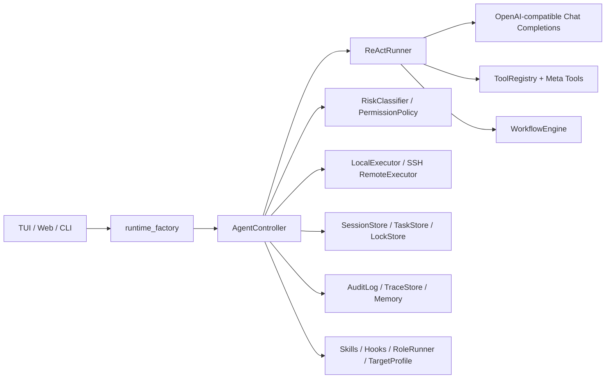

# SysDialogue 项目介绍文档

仓库地址：[PyCmgMagic/SysDialogue](https://github.com/PyCmgMagic/SysDialogue)

## 项目工作量与实现范围

当前仓库已经覆盖 Python 后端 Agent、工具注册与工作流引擎、Local/SSH 执行 runtime、安全风险控制、审批与回滚、审计 Trace 持久化、TUI/CLI/Web API/React Web 控制台、验收矩阵和自动化测试等多个层面。仅按仓库中的 Python、TypeScript、CSS、Markdown、TOML、TXT 等文本文件粗略统计，项目已包含一百多个源码、测试和文档文件，累计接近四万行内容；其中既有可运行代码，也有验收清单、发布就绪、远程运维指南、证据矩阵等配套交付材料。

本项目的主要工作量体现在几个方面：第一，构建了从用户自然语言输入到 LLM 工具调用、任务规划、执行、验证、审计的完整闭环，而不是简单调用模型生成命令；第二，围绕 Linux 运维高风险场景实现了工具分层、风险分级、审批确认、硬拦截、配置备份、失败回滚和远程 SSH 防锁门等安全机制；第三，沉淀了 37 个静态工具、6 个元工具和 10 个内置 workflow，覆盖系统信息、服务管理、文件配置、网络诊断、包管理、用户权限、容器、计划任务等常见运维任务；第四，同时提供 CLI/TUI/Web 多种交互入口，并配套 Web API 和前端控制台展示任务过程、风险提示、执行证据和审计结果；第五，围绕演示和验收补充了 pytest 自动化测试、验收矩阵、release readiness、证据包和操作手册，使项目具备可运行、可检查、可复盘的完整交付形态。

当前仓库已经沉淀约 3.48 万行核心源码、测试、前端样式与 workflow 配置，覆盖后端运行时、ReAct 调度、权限安全、SSH/本机执行、审计追踪、工具体系、验收证据、Web 控制台和测试体系等完整链路；其中包括 84 个后端模块、20 个前端源码文件、26 个工具模块、10 个内置 workflow，以及 24 个测试文件中的 294 个测试用例。

围绕真实高风险运维场景，我们还实现了审批、HARD-BLOCK 硬拦截、回滚、防锁门、动态工具、验收包、突变演练和发布就绪检查等大量工程化细节。整体工作量不仅体现在功能数量上，也体现在从需求理解、执行控制、安全边界、证据留存到交付验证的闭环建设上，体现了项目从原型验证走向可演示、可审计、可交付系统的持续投入。

## 1. 项目概述

SysDialogue 是一个面向 Linux 服务器运维场景的自然语言操作代理。用户可以用中文或英文描述运维目标，例如“检查系统版本、负载、磁盘和端口”或“重启 nginx 并确认恢复正常”，系统会将自然语言需求转化为受控工具调用、内置 workflow 或动态工具执行，并在执行前后完成环境观察、风险判断、审批、审计和结果验证。

本项目不是简单的命令推荐工具，而是一个具备“理解目标、选择工具、执行操作、验证结果、留下证据”的运维 Agent。它把大模型的意图理解能力与 Python 运行时的安全控制、工具编排和审计能力结合起来，使服务器管理过程更接近“可解释、可控制、可复现”的任务流程。

项目主要面向课程作业和实验展示场景，重点体现以下能力：

- 支持自然语言驱动的 Linux 运维交互。
- 支持本机执行和远程 SSH 执行。
- 使用工具调用代替让模型直接输出 shell 命令。
- 对高风险操作进行审批、阻断、回滚和审计。
- 对任务过程进行持久化记录，便于复盘和验证。
- 提供 TUI 与 Web 控制台两种交互入口。

## 2. 背景与问题

Linux 服务器的日常运维通常依赖命令行。命令行具有高效、稳定、可组合的优势，但对普通使用者或初学者来说，也存在明显门槛：

| 问题 | 具体表现 |
| --- | --- |
| 操作门槛高 | 用户需要记忆大量命令、参数和发行版差异。 |
| 环境差异大 | Ubuntu、CentOS、openEuler 等系统在包管理、服务管理、日志工具上存在差异。 |
| 误操作风险高 | 删除文件、修改配置、停止服务、防火墙变更等操作可能导致服务不可用。 |
| 过程不可追踪 | 传统手工操作常常缺少完整记录，事后难以解释“为什么这样做”。 |
| 远程操作风险更高 | 通过 SSH 运维时，错误修改 SSH 服务或防火墙可能导致远程失联。 |

因此，本项目希望降低用户与服务器之间的“沟通成本”：用户不必直接记忆复杂命令，而是通过自然语言表达目标；系统负责把目标拆解成可执行、可审计、可验证的运维步骤。

## 3. 项目目标

SysDialogue 的核心目标是构建一个安全可控的操作系统智能代理，使自然语言运维请求能够进入明确的执行闭环。

项目目标可以概括为四点：

1. 自然语言理解：识别用户的运维意图，判断任务是只读巡检、状态查询、配置修改、服务操作还是复杂连续任务。
2. 工具化执行：所有真实操作都通过静态工具、workflow 或 DynTool 进入 Python runtime，不让模型直接拥有系统执行权。
3. 风险可控：对工具调用进行风险分级，针对高风险动作要求审批，对不可接受动作进行硬拦截。
4. 结果可验证：变更类任务必须进行后置验证，并通过审计日志、Trace、任务记录保存证据。

与传统脚本或命令封装相比，SysDialogue 更关注“任务过程”本身：它不仅执行命令，还会记录任务为什么执行、执行了什么、是否经过审批、结果是否验证成功。

## 4. 核心功能

### 4.1 交互入口

项目提供多个入口，以适应不同使用场景：

| 入口 | 说明 |
| --- | --- |
| TUI | 基于 Textual 的终端交互界面，适合在服务器或控制端直接操作。 |
| Web 控制台 | React + Vite 实现的单页控制台，通过 FastAPI 后端桥接 SysDialogue runtime。 |
| CLI 自检 | `python -m sysdialogue.app.cli --verify`，检查工具、workflow、安全规则和配置状态，不调用模型。 |
| Demo 演示 | `python -m sysdialogue.app.cli --demo`，运行内置安全巡检 workflow，不调用模型。 |
| 计划任务回调 | `--run-scheduled-job <job_id>` 支持 cron 等自动化场景。 |

Web 控制台不会在浏览器中直接建立 SSH 连接，而是通过如下链路执行：

```text
React UI -> FastAPI Web API -> SysDialogue runtime -> Paramiko SSH / LocalExecutor
```

这样可以把浏览器界面、后端运行时、安全策略和执行目标明确分离。

### 4.2 本机模式与远程 SSH 模式

SysDialogue 支持两类执行目标：

- 本机模式：控制端和执行目标是同一台机器。
- 远程 SSH 模式：控制端可以是 Windows 或 Linux，真实操作通过 SSH 在远程 Linux 服务器上执行。

远程模式启动示例：

```powershell
python -m sysdialogue.app.cli --remote user@example.com:22 --ssh-key <ssh_key_path>
```

远程模式下，系统会启用 SSH 防锁门规则。例如禁止在远程模式中停止 SSH 服务、禁用 systemd、flush 防火墙规则、拒绝当前 SSH 端口等操作。这些规则属于硬拦截，不会因为用户确认或安全档位改变而放行。

### 4.3 工具体系

项目当前注册了 37 个静态工具、6 个元工具和 10 个内置 workflow。

37 个静态工具覆盖了服务器运维中的常见对象：

- 系统观察：系统信息、磁盘、进程、端口、网络、资源统计。
- 文件操作：读文件、写文件、目录浏览、搜索内容、备份、替换、归档。
- 用户与权限：创建用户、删除用户、修改用户组、管理 SSH authorized_keys。
- 服务与运行时：systemd/sysvinit 服务、包管理、容器、计划任务、挂载、电源操作。
- 网络与安全：防火墙、DNS、端点连通性、hosts、sysctl、配置校验。

6 个元工具用于控制 Agent 自身的执行过程：

| 元工具 | 作用 |
| --- | --- |
| `set_execution_mode` | 声明 direct、plan 或 workflow 执行模式。 |
| `propose_dynamic_tool` | 注册可复用 DynTool。 |
| `execute_dynamic_tool` | 执行已注册或 inline 动态工具。 |
| `activate_skill` | 激活 Markdown Skill，注入任务上下文。 |
| `handoff_to_role` | 请求内置角色给出结构化建议。 |
| `finish_task` | 收口任务，输出结果和证据。 |

10 个内置 workflow 用 YAML 描述常见运维流程，包括：

- `security_audit`：安全巡检。
- `safe_config_patch`：安全修改配置，包含预览、备份、替换、校验和回滚。
- `rollback_config`：配置回滚。
- `service_restart`：服务重启与复查。
- `disk_cleanup`：磁盘清理。
- `container_rollout`：容器发布。
- `scheduled_health_check`：计划健康检查。
- `new_user`：新用户创建。
- `file_edit`：文件编辑。
- `port_scan`：端口诊断。

### 4.4 DynTool 动态工具

静态工具和 workflow 无法覆盖所有 Linux 命令，因此项目保留 DynTool 能力，用于处理临时诊断命令或可复用命令族。DynTool 支持两种执行模式：

- `argv`：参数数组模式，适合结构化命令，默认更安全。
- `shell`：shell 字符串模式，适合管道、重定向和复合命令，由安全档位控制。

DynTool 不是绕过安全的后门。即使是动态命令，也必须经过命令安全检查、风险分类、权限策略、审批、审计和 ReAct 完成门。未能证明只读的动态命令会按保守方式处理。

## 5. 系统架构

SysDialogue 采用分层架构，把模型理解、任务控制、工具执行、安全审计和界面展示拆开。



### 5.1 LLM 接入层

LLM 接入层使用 OpenAI-compatible Chat Completions tool calls。模型负责理解用户目标、选择工具、填写结构化参数和解释执行结果，但不直接接触操作系统。

项目要求真实操作必须通过 function call 进入 Python runtime。这样可以把模型的不确定输出限制在受控工具协议内，减少“模型直接给出危险命令”的风险。

### 5.2 Agent 控制层

`AgentController` 是系统主控，负责把 LLM、工具注册表、安全策略、运行时执行器、审计、状态存储等模块串联起来。它的核心职责包括：

- 构建系统提示词和工具 schema。
- 接收模型 tool call。
- 标准化工具参数。
- 调用风险分类和权限策略。
- 发起审批请求。
- 调用本地或远程执行器。
- 写入审计日志和 trace。
- 更新会话、任务和锁状态。

### 5.3 ReAct 任务闭环

`ReActRunner` 将每个用户请求建模为一个任务。任务不是单次工具调用，而是一个“观察、执行、验证、收口”的闭环。

典型流程如下：

```text
task_started -> observe -> plan/act -> verify -> finish_task
```

如果任务是变更类操作，例如修改配置或重启服务，系统要求必须完成后置验证，不能在没有证据的情况下直接标记为 completed。

### 5.4 工具层与工作流层

工具层通过 `ToolRegistry` 集中注册所有静态工具 schema 和调用入口。工作流层通过 YAML 描述多步运维流程，适合把高频场景固化为可审计的步骤。

例如 `safe_config_patch` 的流程是：

```text
stat_path -> read_file -> dry-run diff -> approval -> backup_path -> replace_in_file -> validate_config -> optional reload -> optional endpoint check
```

如果校验失败，workflow 会尝试回滚到备份版本，并在审计记录中保留备份 id、校验结果和回滚结果。

### 5.5 运行时执行层

执行层抽象了本机和远程两种环境：

- `LocalExecutor`：在本地执行命令，默认使用 `shell=False`，降低命令注入风险。
- SSH 远程执行：通过 Paramiko 连接远程 Linux 目标机。
- `SafeExecutor`：提供超时、输出截断、错误规范化等公共能力。
- `PrivilegeManager`：处理需要 sudo 的场景，避免密码出现在命令参数、进程列表或审计日志中。

### 5.6 状态、审计与 Trace

系统使用 `~/.sysdialogue/` 保存运行状态：

| 目录 | 内容 |
| --- | --- |
| `sessions/` | 会话与上下文。 |
| `tasks/` | 任务记录、步骤、阶段和 heartbeat。 |
| `locks/` | 跨进程资源锁和 lease。 |
| `audit/` | JSONL 审计日志。 |
| `traces/` | LLM 调用、工具调用和运行过程 trace。 |
| `memory/` | 长期记忆和 `MEMORY.md`。 |
| `targets/` | 目标机画像。 |

这些记录可以支撑事后复盘：用户可以知道一次任务为什么触发审批、执行了哪些工具、结果是什么、是否通过验证。

## 6. 关键安全设计

### 6.1 Function Call Only

SysDialogue 的核心安全边界是 Function Call Only。模型不能直接执行 shell，也不能把底层命令作为用户手工复制的操作建议。所有会读取环境、修改配置、调用 SSH 或执行动态命令的动作，都必须通过 tool call 进入 Python runtime。

该设计带来三个好处：

- 可控：所有真实操作都要经过统一安全策略。
- 可审计：每次操作都对应工具名、参数、风险判断、审批状态和执行结果。
- 可验证：变更类任务必须产生后置验证证据。

### 6.2 风险分级

`RiskClassifier` 对工具调用进行风险分类：

| 风险等级 | 含义 | 处理方式 |
| --- | --- | --- |
| `SAFE` | 只读或低影响操作 | 自动执行并审计。 |
| `WARN-LOW` | 低风险但需要提示的操作 | 记录风险提示和审计。 |
| `WARN-HIGH` | 可能影响系统状态或可用性 | 必须用户审批。 |
| `BLOCK` | 不允许执行的危险操作 | 直接拒绝，不能审批放行。 |

例如，读取普通系统信息是 `SAFE`，停止服务通常是 `WARN-HIGH`，删除 root 用户、递归删除系统目录或远程禁用 SSH 属于 `BLOCK`。

### 6.3 三档安全配置

项目提供三个安全档位：

| 安全档位 | 适用场景 |
| --- | --- |
| `standard` | 默认模式，动态命令策略最保守。 |
| `operator` | 受控运维模式，放宽部分低风险动态命令。 |
| `break_glass` | 应急高能力模式，允许更复杂的 DynTool shell 能力，但 `BLOCK` 仍不可覆盖。 |

三档配置改变的是可接受风险边界，不改变硬拦截规则。凭证泄露、毁盘命令、核心目录删除和远程 SSH 自锁等操作始终会被拒绝。

### 6.4 审批与回滚

当工具调用被判定为 `WARN-HIGH` 时，系统会向用户展示审批请求。审批内容包括工具名、风险等级、规则 id、风险原因、参数预览和回滚提示。

对配置修改类任务，系统优先使用 workflow：

- 修改前读取文件和生成 dry-run diff。
- 修改前创建备份。
- 修改后执行配置校验。
- 校验失败时自动回滚。
- 回滚失败时给出人工介入提示。

### 6.5 远程 SSH 防锁门

远程运维场景中，最严重的问题之一是“自己把自己锁在服务器外面”。SysDialogue 对远程模式增加了专门规则：

- 禁止停止或禁用 SSH 服务。
- 禁止停止或禁用 systemd。
- 禁止 flush 防火墙规则。
- 禁止把默认防火墙策略设置为 drop 或 reject。
- 禁止拒绝当前 SSH 端口或 SSH 服务流量。

这些规则由 `remote_lockout.py` 统一实现，并叠加到风险分类结果中。

## 7. 典型使用场景

### 7.1 只读系统巡检

用户输入：

```text
检查系统版本、负载、磁盘空间和监听端口，只读执行并总结需要关注的风险。
```

系统可能调用：

- `get_system_info`
- `get_disk_usage`
- `get_resource_stats`
- `get_port_status`

该场景展示系统的环境观察能力，风险等级通常为 `SAFE`。

### 7.2 服务重启与验证

用户输入：

```text
重启 nginx，并确认它恢复正常。
```

系统执行路径：

1. 查询服务状态。
2. 判断重启服务风险。
3. 请求用户审批。
4. 执行 restart。
5. 再次查询状态，必要时检查端点。
6. 输出结果和验证证据。

该场景体现了“变更前观察、变更中审批、变更后验证”的闭环。

### 7.3 安全修改配置

用户输入：

```text
把 nginx 配置里的 keepalive_timeout 改成 65，并验证配置。
```

系统优先命中 `safe_config_patch` workflow。它会先读取文件并生成替换预览，再请求确认，随后备份、修改、校验。如果验证失败，系统会尝试自动回滚。

### 7.4 远程高风险阻断

用户输入：

```text
远程服务器上关闭 sshd。
```

在远程模式下，该操作会命中 SSH 防锁门规则，被判定为 `BLOCK`。系统不会执行该操作，而是解释拒绝原因并记录审计。

### 7.5 动态诊断命令

当静态工具和 workflow 无法覆盖某个发行版专用诊断命令时，系统可以使用 DynTool inline 执行一次性命令。动态命令仍然走安全链路，不能绕过审批、审计和硬拦截。

## 8. 技术栈

| 分类 | 技术 |
| --- | --- |
| 后端语言 | Python 3.11+ |
| Web API | FastAPI、Uvicorn、Pydantic |
| 模型接口 | OpenAI-compatible Chat Completions tool calls |
| 远程连接 | Paramiko SSH |
| TUI | Textual、Rich |
| 前端 | React、Vite、TypeScript |
| 前端样式 | Tailwind CSS、Radix/shadcn 风格组件、lucide-react icons |
| 工作流 | YAML、Jinja2 模板 |
| 状态存储 | JSON + filelock |
| 测试 | pytest、前端 typecheck/build |

项目脚本入口包括：

```powershell
python -m sysdialogue.app.cli --verify
python -m sysdialogue.app.cli --demo
python -m sysdialogue.app.cli
python -m sysdialogue.app.web_api
```

前端启动方式：

```powershell
cd web
npm run dev
```

## 9. 验证方式

项目提供多层验证方式，便于课程作业展示和老师检查。

### 9.1 自检与演示

```powershell
python -m sysdialogue.app.cli --verify
python -m sysdialogue.app.cli --demo
```

`--verify` 用于检查环境、工具注册、workflow、安全规则和配置状态；`--demo` 用于展示内置安全巡检 workflow。两者都不需要调用模型 API。

### 9.2 验收矩阵与发布就绪

项目中包含验收矩阵和 release readiness 机制，用于把功能完成情况映射到可检查证据。相关能力包括：

- `sysdialogue --evidence`
- `sysdialogue --acceptance`
- `sysdialogue --acceptance-runner`
- `sysdialogue --release-readiness <path>`
- `sysdialogue --release-gate <path>`

这些命令可以帮助检查启动、对话、变更安全、恢复、审计、可用性和安全卫生等维度。

### 9.3 自动化测试

后端可通过 pytest 运行测试。项目中已有测试覆盖 CLI 入口、TUI 格式、Web API、workflow、风险规则、SSH 适配、ReAct 运行、验收清单、release readiness 等模块。

推荐检查命令：

```powershell
python -m pytest tests -q
```

前端可执行：

```powershell
cd web
npm run check
npm run build
```

### 9.4 可观察输出

运行后可以查看本地状态目录：

```powershell
Get-ChildItem $env:USERPROFILE\.sysdialogue\sessions
Get-ChildItem $env:USERPROFILE\.sysdialogue\tasks
Get-ChildItem $env:USERPROFILE\.sysdialogue\audit
Get-ChildItem $env:USERPROFILE\.sysdialogue\traces
```

这些文件记录任务过程、工具执行、安全判断、审批结果和最终输出，是验证系统真实性的重要证据。

## 10. 项目成果

截至当前版本，SysDialogue 已实现：

- OpenAI-compatible tool-calling 客户端。
- TUI、CLI、Web API 和 Web 控制台。
- 本机执行与远程 SSH 执行。
- 37 个静态工具、6 个元工具、10 个 workflow。
- ReAct 任务级闭环。
- Function Call Only 安全边界。
- 风险分级、审批、硬拦截和远程 SSH 防锁门。
- 变更后验证、备份与回滚能力。
- Session、Task、Lock、Audit、Trace、Memory 等持久化记录。
- 验收矩阵、release readiness 和证据包能力。
- 较完整的后端与前端测试入口。

## 11. 不足与后续改进

作为课程项目，SysDialogue 已具备较完整的原型和工程结构，但仍有进一步改进空间：

- 真实环境长期运行验证还可以加强，例如在多个 Linux 发行版上持续测试。
- Web 控制台可增加更多图表化展示，例如任务耗时、风险分布和审计趋势。
- 多目标服务器管理可以进一步完善，例如主机分组、批量只读巡检和权限隔离。
- 语音输入、多模态交互等探索能力可以作为后续扩展。
- 对更复杂的故障诊断场景，可以增加更多内置 workflow 和知识化 playbook。

## 12. 总结

SysDialogue 的核心价值在于把自然语言交互、Agent 工具调用和运维安全控制结合起来。它既利用大模型降低命令行使用门槛，也通过 Python runtime 保留执行边界和审计能力。

从课程作业角度看，本项目体现了以下设计重点：

- 不是只做聊天，而是实现了可运行的运维执行链路。
- 不是直接生成命令，而是通过工具协议统一控制风险。
- 不是只关注成功路径，而是考虑了审批、阻断、验证、回滚和审计。
- 不是单一界面，而是提供 TUI、CLI、Web API 和 Web 控制台等多入口。

因此，SysDialogue 可以作为“操作系统智能代理”方向的一个完整实践：让用户用自然语言提出目标，让系统以安全、透明、可验证的方式完成服务器运维任务。
