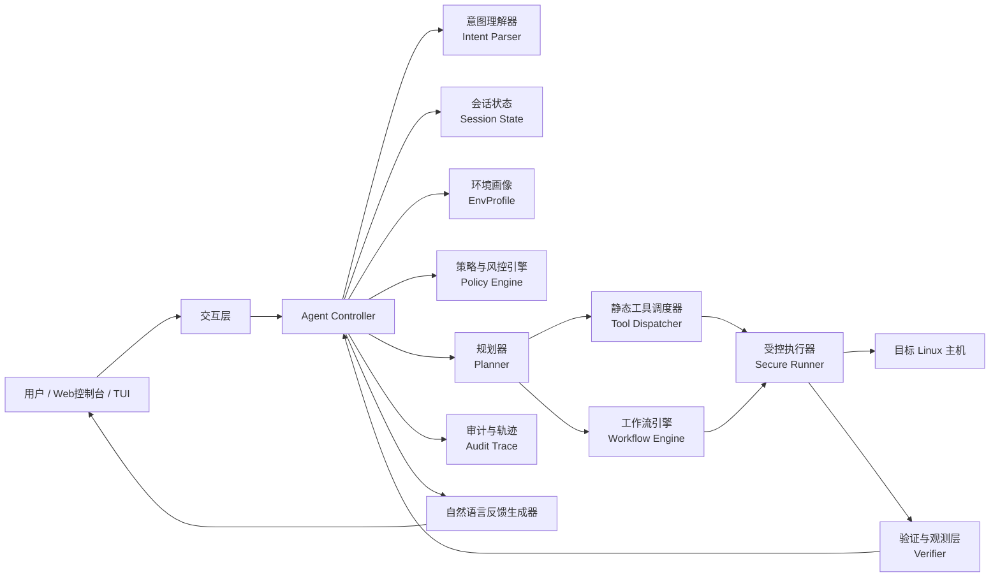
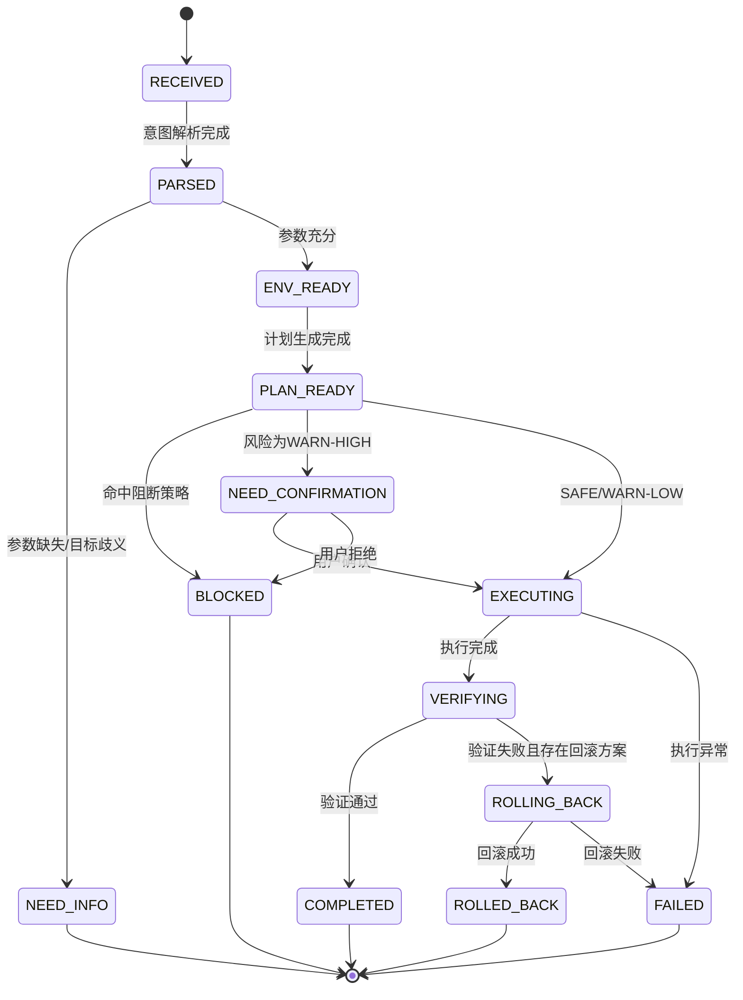

# SysDialogue：操作系统智能代理参赛方案设计文档（提交版）

> 文档版本：V1.0  
> 文档定位：比赛提交版总设计文档  
> 适用范围：真实 Linux 环境下的自然语言系统管理代理  
> 设计原则：Static-first / Workflow-first / Policy-before-action / Verify-after-change / Audit-by-default  
> 备注：本版本以“参赛可验证、可解释、可落地”为第一目标，对现有能力做了裁剪、重组与闭环增强。

---

## 目录

1. 项目概述
2. 赛题理解与设计目标
3. 设计边界与总体策略
4. 总体架构设计
5. 核心运行机制
6. 工具体系设计
7. 工作流体系设计
8. 风险控制与安全策略
9. 环境感知与适配机制
10. 审计、解释与回滚设计
11. 交互形态与用户体验设计
12. 典型场景与评分映射
13. 工程实现方案
14. 测试与验证方案
15. 非目标、限制与边界说明
16. 迭代路线图
17. 附录

---

## 1. 项目概述

SysDialogue 是一个面向 Linux 服务器运维场景的操作系统智能代理。用户通过自然语言输入系统管理需求，代理完成以下闭环：

- 理解用户意图；
- 感知当前操作系统环境；
- 在受控工具体系内规划执行路径；
- 对高风险操作进行预警、确认或拒绝；
- 在真实 Linux 环境中执行操作；
- 对结果进行验证、解释与审计记录；
- 在必要时执行回滚与异常恢复。

本方案不把大模型当作“命令生成器”，而是把它作为“语义理解与任务规划器”；真正的执行由静态工具、内置工作流和受控执行器完成。整个系统强调自主决策、边界明确、过程可追溯、结果可验证，避免退化为简单的命令透传代理。

---

## 2. 赛题理解与设计目标

### 2.1 对赛题的理解

本题核心不是做一个“会聊天的运维机器人”，而是做一个能够在真实 Linux 环境中完成系统管理闭环的智能代理。系统必须同时满足以下要求：

1. **真实可运行**：能够在真实 Linux 环境中完成查询、配置、管理等任务。  
2. **自然语言驱动**：用户不需要记忆命令，系统负责理解意图并自主选择工具路径。  
3. **自主与可控**：不能只是把自然语言转成 shell 透传执行，必须体现独立的决策逻辑。  
4. **高风险防控**：能够识别、预警、限制、拒绝高风险或不合理操作。  
5. **过程可解释**：能够说明为何这样执行、为何提示风险、为何拒绝某操作。  
6. **多步任务闭环**：不仅能处理单轮查询，还能稳定处理多步、连续、带状态的任务。  
7. **可审计与可复现**：要能输出操作记录、执行轨迹、验证材料和设计说明。

### 2.2 设计目标

围绕评分重点，本方案设定以下六个目标：

- **G1：基础系统管理能力完整可演示**  
  覆盖磁盘、进程、端口、文件检索、用户管理、服务管理、配置修改等高频任务。

- **G2：环境感知驱动决策**  
  能识别发行版、包管理器、服务管理器、防火墙后端、配置校验器等差异，并自动选择合适执行路径。

- **G3：高风险操作可识别、可限制、可拒绝**  
  具备语义级与工具级双层风控机制，确保系统不会因为一次模糊请求而做出危险操作。

- **G4：多步任务具备完整闭环**  
  对配置变更、故障排查、计划任务等连续任务实现“预览—备份—执行—校验—回滚”的闭环。

- **G5：过程与结果对用户清晰可解释**  
  每次操作都能展示计划、风险依据、执行结果、验证结论和后续建议。

- **G6：参赛材料可复现、可答辩、可落地**  
  输出完整的架构设计、工具定义、Prompt 骨架、日志格式、验证场景和工程结构。

---

## 3. 设计边界与总体策略

### 3.1 参赛版总体策略

为了保证稳定性与可答辩性，参赛版采用如下冻结策略：

- **参赛模式默认启用 28 个静态工具**；
- **内置 6 个核心工作流**，覆盖高频高分场景；
- **DynTool 在 competition mode 下关闭**，避免方案退化为动态命令代理；
- **高风险能力不追求“全能”，而追求“边界清晰、可控可解释”**；
- **默认演示路径优先使用静态工具 + 工作流**，不依赖现场拼命令。

### 3.2 部署模式

系统支持两种部署方式：

1. **本地部署模式**：代理与目标 Linux 系统部署在同一台主机上；  
2. **远程代理模式**：控制端部署在外部环境，通过 SSH 连接目标 Linux 服务器执行受控操作。

对用户而言，部署位置透明；对系统而言，执行链路统一由受控执行层封装。

### 3.3 参赛版能力边界

参赛版不追求覆盖所有 Linux 管理动作，而是聚焦以下原则：

- 查询能力优先稳定；
- 变更能力优先可验证、可回滚；
- 高风险动作必须有强边界；
- 不支持任意 shell 透传；
- 不支持通过通用文本编辑直接修改核心安全配置；
- 不把“极高破坏性动作”纳入默认演示范围。

### 3.4 competition mode 约束

```yaml
competition_mode:
  enable_dynamic_tool: false
  allow_arbitrary_shell: false
  require_audit_trace: true
  require_verify_after_mutation: true
  require_user_confirmation_for_warn_high: true
  protected_configs_strict_mode: true
```

---

## 4. 总体架构设计

### 4.1 架构总览



### 4.2 分层说明

#### 4.2.1 交互层

提供 Web 或 TUI 交互界面，核心职责包括：

- 接收自然语言输入；
- 展示计划预览、风险提示、差异预览、执行时间线；
- 在需要时向用户发起二次确认；
- 呈现最终结果、验证结论与回滚信息。

#### 4.2.2 Agent Controller

系统总控模块，负责串联一次请求的完整生命周期，包括：

- 会话管理；
- 调用意图理解器；
- 触发环境探测；
- 交给策略引擎判定风险；
- 选择工具链或工作流；
- 驱动执行与验证；
- 生成审计记录与最终自然语言反馈。

#### 4.2.3 意图理解器

大模型只负责语义层工作，不直接输出 shell 命令。其职责包括：

- 意图分类；
- 参数抽取；
- 目标对象识别；
- 风险语义提示；
- 将自然语言转成结构化任务描述。

#### 4.2.4 策略与风控引擎

在执行前做统一安全判定，包括：

- 语义级风险识别；
- 工具级风险判定；
- 路径级保护规则；
- 环境级约束校验；
- 确认策略生成。

#### 4.2.5 规划器

把结构化意图转成执行计划。规划器只输出以下两类产物：

- **静态工具调用链**；
- **内置工作流调用图**。

规划器不输出任意 shell 文本。

#### 4.2.6 工作流引擎

用于承载多步、可恢复、带验证的任务闭环，支持：

- 条件分支；
- 失败分支；
- 回滚钩子；
- 步骤重试；
- 资源锁；
- 步骤级证据记录。

#### 4.2.7 受控执行器

执行器只接受结构化工具调用，不接受模型直接生成的命令字符串。其职责包括：

- 将工具参数映射为白名单命令模板；
- 参数规范化与转义；
- 本地或远程执行；
- 收集 stdout/stderr/exit code；
- 返回标准化结果。

#### 4.2.8 验证与观测层

所有变更类操作完成后必须进入验证层。验证层负责：

- 状态复核；
- 服务健康检查；
- 配置合法性校验；
- 端口与接口连通性检查；
- 回滚触发条件判断。

#### 4.2.9 审计与轨迹层

系统自动生成结构化执行轨迹，满足：

- 可回放；
- 可追踪；
- 可展示；
- 可用于视频和答辩。

---

## 5. 核心运行机制

### 5.1 统一执行闭环

每次请求都遵循固定闭环：

```text
自然语言输入
→ 意图解析
→ 参数与目标识别
→ 环境感知
→ 风险判定
→ 计划生成
→ 预览/确认
→ 执行
→ 验证
→ 回滚或完成
→ 自然语言反馈
→ 审计记录
```

### 5.2 执行状态机



### 5.3 五类系统决策状态

| 状态 | 含义 | 系统行为 |
|---|---|---|
| NEED_INFO | 参数不足或目标不明确 | 询问最小必要信息，不执行 |
| PLAN_READY | 计划已生成 | 向用户展示执行路径和影响面 |
| NEED_CONFIRMATION | 高风险但允许执行 | 展示风险依据、回滚方案，请求确认 |
| BLOCKED | 命中阻断规则 | 明确拒绝并说明原因 |
| COMPLETED / ROLLED_BACK / FAILED | 已结束 | 输出结果、验证、回滚或失败原因 |

### 5.4 读操作与写操作的差异化路径

#### 读操作

```text
意图解析 → 环境判断 → 调用查询类静态工具 → 汇总结果 → 反馈
```

#### 写操作

```text
意图解析 → 风险评估 → 计划预览 → 备份/确认 → 执行 → 验证 → 回滚或完成 → 审计
```

### 5.5 规划原则

- **能用工作流时不用临时工具链**；
- **能用静态工具时不用动态能力**；
- **先读后改，先看对象再修改对象**；
- **所有变更型任务必须定义验证动作**；
- **所有高风险变更必须定义回滚方案**。

---

## 6. 工具体系设计

### 6.1 设计原则

工具体系采用“语义静态工具”方式建模，每个工具具备：

- 明确的能力边界；
- 结构化输入参数；
- 风险等级；
- 输入校验规则；
- 输出标准化格式；
- 对应的白名单执行模板；
- 可被工作流编排。

### 6.2 参赛版工具冻结范围

参赛版总计纳入 **28 个静态工具**。其中：

- **26 个核心工具默认启用**；
- **2 个扩展工具按 feature flag 打开**；
- **DynTool 在参赛模式下关闭**。

### 6.3 核心静态工具清单（默认启用）

#### 6.3.1 系统观察类工具

| 工具名 | 说明 | 类型 | 默认风险 |
|---|---|---|---|
| `get_system_info` | 查询主机名、发行版、内核、架构、当前用户等基础信息 | 读 | SAFE |
| `get_disk_usage` | 查询磁盘使用情况、挂载点容量 | 读 | SAFE |
| `get_memory_usage` | 查询内存与 Swap 使用情况 | 读 | SAFE |
| `get_cpu_load` | 查询 CPU 使用率、负载信息 | 读 | SAFE |
| `list_processes` | 查看进程列表，可按名称或 PID 过滤 | 读 | SAFE |
| `check_port_usage` | 查看端口监听情况、对应进程 | 读 | SAFE |
| `list_directory` | 浏览目录结构，支持深度限制 | 读 | SAFE / WARN-LOW |
| `find_paths` | 按名称或 glob 查找文件和目录 | 读 | SAFE / WARN-LOW |
| `stat_path` | 查询文件/目录元数据 | 读 | SAFE / WARN-LOW |
| `read_file` | 按 head/tail/range 模式安全读取文本文件 | 读 | SAFE / WARN-LOW / BLOCK |
| `read_logs` | 查看日志文件或 journald 片段 | 读 | SAFE / WARN-LOW |
| `search_file_content` | 在允许范围内按 literal/regex 搜索内容 | 读 | WARN-LOW / BLOCK |

#### 6.3.2 用户与权限类工具

| 工具名 | 说明 | 类型 | 默认风险 |
|---|---|---|---|
| `manage_user` | 创建、删除、查询普通用户，控制默认组、shell、home | 写 | SAFE / WARN-HIGH / BLOCK |
| `manage_group` | 创建、删除、查看用户组，管理普通组成员 | 写 | SAFE / WARN-HIGH / BLOCK |
| `manage_authorized_keys` | 为指定普通用户增删查 SSH 公钥 | 写 | SAFE / WARN-HIGH / BLOCK |

#### 6.3.3 服务与软件类工具

| 工具名 | 说明 | 类型 | 默认风险 |
|---|---|---|---|
| `manage_service` | 查看、启动、停止、重启、重载服务 | 写 | SAFE / WARN-LOW / WARN-HIGH |
| `manage_package` | 安装、卸载、查询、升级软件包 | 写 | SAFE / WARN-HIGH |
| `manage_firewall` | 查看、放行、删除、重载防火墙规则 | 写 | SAFE / WARN-HIGH / BLOCK |
| `manage_sysctl` | 查询和设置内核参数，支持持久化 | 写 | SAFE / WARN-HIGH / BLOCK |
| `manage_hosts_entries` | 安全管理 hosts 映射 | 写 | SAFE / WARN-HIGH / BLOCK |
| `manage_cron` | 创建、更新、禁用系统内部计划任务 | 写 | SAFE / WARN-HIGH / BLOCK |

#### 6.3.4 配置变更与验证类工具

| 工具名 | 说明 | 类型 | 默认风险 |
|---|---|---|---|
| `backup_path` | 创建、列出、恢复、删除备份 | 写 | SAFE / WARN-HIGH / BLOCK |
| `replace_in_file` | 对文本进行精准替换，支持匹配数校验 | 写 | WARN-HIGH / BLOCK |
| `validate_config` | 对 nginx、sshd、systemd、json/yaml 等配置做合法性校验 | 读 | SAFE / WARN-LOW |

#### 6.3.5 网络诊断类工具

| 工具名 | 说明 | 类型 | 默认风险 |
|---|---|---|---|
| `resolve_dns` | DNS 解析诊断 | 读 | SAFE |
| `check_endpoint` | ping、tcp、http、tls 连通性与健康检查 | 读 | SAFE / WARN-LOW |

### 6.4 扩展工具（feature flag，非主演示路径）

| 工具名 | 说明 | 默认状态 | 风险 |
|---|---|---|---|
| `manage_archive` | 安全归档、解压、列出压缩内容 | 关闭 | WARN-LOW / WARN-HIGH / BLOCK |
| `manage_container` | 对 docker/podman 做结构化基础运维 | 关闭 | SAFE / WARN-HIGH / BLOCK |

### 6.5 不纳入参赛默认能力的高风险工具

以下能力不纳入参赛默认启用范围，只作为后续扩展预留：

- 系统关机与重启；
- 通用挂载管理；
- 核心账号、核心认证链路的通用文本修改；
- 任意 shell 执行；
- 容器 `exec shell` 与特权模式；
- 动态工具生成与执行。

### 6.6 工具设计规范

所有变更型工具统一支持以下返回字段：

```json
{
  "success": true,
  "change_id": "chg_20260423_xxx",
  "risk_level": "WARN-HIGH",
  "summary": "已将 nginx 端口从 8080 改为 8081",
  "evidence": [],
  "verify_hint": [],
  "rollback_token": "rbk_20260423_xxx"
}
```

### 6.7 关键工具的特殊约束

#### 6.7.1 `replace_in_file`

- 必须提供 `path`、`search`、`replace`；
- 支持 `dry_run=true` 做变更预览；
- 支持 `expected_matches`，不匹配则直接失败；
- 对关键路径直接 BLOCK 或转入专用工作流；
- 默认返回 diff 摘要与备份信息。

#### 6.7.2 `manage_cron`

- 不允许写入任意 shell 文本；
- 只允许调度本系统已注册工具或工作流；
- 创建前递归评估被调度目标的风险等级；
- 若目标为 BLOCK，则计划任务本身直接 BLOCK。

#### 6.7.3 `manage_authorized_keys`

- 只接受合法公钥，不允许疑似私钥内容；
- 不允许删除最后一个受信任管理员入口；
- root 账户公钥修改默认 BLOCK；
- 对当前会话相关账户做保守限制。

#### 6.7.4 `manage_container`

- 不提供 `exec`；
- 不提供 `privileged=true`；
- 不提供 `network_mode=host`；
- 对 bind mount 做敏感路径检查。

---

## 7. 工作流体系设计

### 7.1 工作流设计目标

工作流用于承载多步、连续、需要验证和回滚的任务。相比单个工具调用，工作流更适合：

- 配置变更；
- 故障排查；
- 连续诊断；
- 周期性健康检查；
- 用户开通等带状态流程。

### 7.2 参赛版核心工作流

| 工作流名 | 目标 | 核心步骤 | 是否主演示 |
|---|---|---|---|
| `health_snapshot` | 一次性查看主机健康状态 | 磁盘、内存、CPU、端口、服务摘要 | 是 |
| `standard_user_provision` | 安全创建普通用户 | 创建用户、加组、配置公钥、结果验证 | 是 |
| `safe_config_patch` | 安全修改配置文件 | 读取上下文、预览 diff、备份、替换、校验、验证 | 是 |
| `rollback_config` | 失败后的配置恢复 | 列备份、选择版本、恢复、校验、复核 | 是 |
| `service_endpoint_diagnosis` | 服务不可用排查 | 端口、进程、服务状态、DNS、HTTP/TCP 检查、日志摘要 | 是 |
| `scheduled_health_check` | 建立可解释的周期巡检 | 创建 cron、周期检查 endpoint、记录结果 | 是 |

### 7.3 工作流编排能力

每个工作流节点统一支持：

- `depends_on`：依赖上一步结果；
- `condition`：条件执行；
- `retry_policy`：重试次数与退避策略；
- `timeout`：步骤超时；
- `on_fail`：失败分支；
- `rollback`：回滚动作；
- `lock_scope`：资源锁作用域；
- `evidence`：记录关键证据。

### 7.4 代表性工作流：`safe_config_patch`

```yaml
name: safe_config_patch
summary: 在受控边界内安全修改配置文件
parameters:
  - {name: file_path, type: text, required: true}
  - {name: search_text, type: text, required: true}
  - {name: replace_text, type: text, required: true}
  - {name: validator, type: text, required: false, default: auto}
  - {name: service_name, type: text, required: false}
  - {name: verify_endpoint, type: object, required: false}

steps:
  - id: s1
    type: tool_call
    tool: stat_path
    args:
      path: "{{file_path}}"

  - id: s2
    type: tool_call
    tool: read_file
    args:
      path: "{{file_path}}"
      mode: head
      head_lines: 80
    depends_on: [s1]

  - id: s3
    type: tool_call
    tool: replace_in_file
    args:
      path: "{{file_path}}"
      search: "{{search_text}}"
      replace: "{{replace_text}}"
      dry_run: true
      expected_matches: 1
    depends_on: [s2]

  - id: s4
    type: approval
    template: |
      将对 {{file_path}} 进行如下修改：
      {{s3.result.diff_preview}}
      风险等级：{{s3.result.risk_level}}
      将先创建备份，再执行修改与校验。
    depends_on: [s3]

  - id: s5
    type: tool_call
    tool: backup_path
    args:
      action: create
      path: "{{file_path}}"
    depends_on: [s4]

  - id: s6
    type: tool_call
    tool: replace_in_file
    args:
      path: "{{file_path}}"
      search: "{{search_text}}"
      replace: "{{replace_text}}"
      create_backup: false
      expected_matches: 1
    depends_on: [s5]
    lock_scope: "file:{{file_path}}"

  - id: s7
    type: tool_call
    tool: validate_config
    args:
      target_type: "{{validator}}"
      path: "{{file_path}}"
    depends_on: [s6]
    on_fail: rollback

  - id: s8
    type: tool_call
    tool: manage_service
    args:
      action: reload
      name: "{{service_name}}"
    depends_on: [s7]
    condition: "{{service_name is not none}}"
    on_fail: rollback

  - id: s9
    type: tool_call
    tool: check_endpoint
    args: "{{verify_endpoint}}"
    depends_on: [s8]
    condition: "{{verify_endpoint is not none}}"
    on_fail: rollback

rollback:
  - id: r1
    type: tool_call
    tool: backup_path
    args:
      action: restore
      backup_id: "{{s5.result.backup_id}}"
      path: "{{file_path}}"

final:
  success_template: "配置修改完成，已通过校验{{service_name and '并完成服务重载' or ''}}。"
  rollback_template: "修改后验证失败，已自动回滚到备份版本。"
```

### 7.5 资源锁设计

为避免多轮会话或并发请求对同一资源重复修改，工作流执行时支持资源锁：

- 文件锁：`file:/etc/nginx/nginx.conf`；
- 服务锁：`service:nginx`；
- 用户锁：`user:alice`；
- 计划任务锁：`cron:job_xxx`。

同一锁作用域上不允许同时执行两个变更型工作流。

---

## 8. 风险控制与安全策略

### 8.1 风控总体思路

本系统采用 **语义级 + 工具级 + 路径级 + 环境级** 的四层风控机制。

#### 第一层：语义级风险识别

先判断用户意图本身是否危险，即使某个工具表面上“可以执行”，也可能因为意图恶意而被阻断。

#### 第二层：工具级风险识别

根据工具类型、动作类型、影响面大小判定 SAFE / WARN-LOW / WARN-HIGH / BLOCK。

#### 第三层：路径级与对象级保护

对核心目录、关键配置、凭证路径、root 相关对象、敏感挂载点等进行额外保护。

#### 第四层：环境级安全判断

结合当前发行版、服务管理器、权限模式、SELinux/AppArmor、现有服务状态等做额外校验。

### 8.2 风险等级定义

| 等级 | 含义 | 处理方式 |
|---|---|---|
| SAFE | 低风险、只读或可直接执行 | 自动执行 |
| WARN-LOW | 轻度风险 | 自动执行并明确提示 |
| WARN-HIGH | 高风险但合理 | 展示计划、影响面、回滚方案，需确认 |
| BLOCK | 高风险、不合理、非法或超出边界 | 直接拒绝 |
| NEED_INFO | 信息不足 | 要求补充信息后再决策 |

### 8.3 语义级阻断类别

以下类型命中后直接 BLOCK：

1. **破坏性删除**  
   例如删除 `/etc`、`/boot`、系统核心目录或大范围删除关键文件。

2. **越权与提权**  
   例如将所有普通用户加入 sudo、批量修改高权限身份、为 root 植入未经授权的访问入口。

3. **安全弱化**  
   例如开启空密码登录、弱化 SSH 安全配置、关闭关键访问控制。

4. **后门与持久化**  
   例如悄悄添加 root 公钥、建立隐藏计划任务、放开异常公网入口。

5. **痕迹清除与规避审计**  
   例如删除全部日志、要求“不留痕迹”、规避监控或关闭审计。

6. **敏感凭证窃取**  
   例如读取私钥、密码文件、系统凭证目录。

### 8.4 路径级保护集合

#### 8.4.1 核心保护路径

```text
/
/boot
/etc/passwd
/etc/shadow
/etc/gshadow
/etc/sudoers
/etc/sudoers.d/
/etc/ssh/sshd_config
/proc
/sys
/dev
/run
/root
```

#### 8.4.2 敏感凭证路径

```text
~/.ssh/
/root/.ssh/
/etc/ssh/
/etc/pki/
/etc/ssl/private/
/var/lib/*/secrets/
```

#### 8.4.3 默认阻断对象

- root 用户的授权密钥修改；
- 核心认证与授权配置的通用文本替换；
- 受保护 hosts 基础项；
- 计划任务中嵌入的高风险目标。

### 8.5 二次确认协议

对于 WARN-HIGH 级操作，确认面板必须展示：

- 用户原始请求；
- 结构化执行计划；
- 影响对象与影响范围；
- 关键 diff 或变更摘要；
- 预计验证动作；
- 回滚方案。

确认消息模板：

```text
你请求的是高风险系统变更：修改 nginx 配置并重载服务。
影响对象：/etc/nginx/nginx.conf
计划动作：备份 → 精准替换 → 配置校验 → reload → 端口检查
回滚方式：恢复 backup_id=xxx
请确认是否继续执行。
```

### 8.6 高风险但支持的专用能力

对于确有合理业务价值但风险较高的能力，系统采用“专用流程 + 强约束”的方式支持，而不是开放通用能力。例如：

- 配置修改必须经过 `safe_config_patch`；
- 计划任务必须是“调度工具/工作流”，不能嵌入任意 shell；
- 防火墙变更必须显示端口、协议、作用域；
- 普通用户创建不得默认赋予 sudo。

---

## 9. 环境感知与适配机制

### 9.1 EnvProfile 设计目标

EnvProfile 用于描述目标主机的可执行环境，支撑系统根据不同 Linux 发行版自动调整工具实现路径。

### 9.2 EnvProfile 字段定义

```python
class EnvProfile(TypedDict):
    hostname: str
    distro_id: str
    distro_version: str
    kernel_version: str
    architecture: str
    current_user: str
    has_sudo: bool

    package_manager: str          # apt / dnf / yum / zypper / unknown
    service_manager: str          # systemd / service / unknown
    firewall_backend: str         # firewalld / ufw / nftables / none
    init_system: str              # systemd / sysvinit / unknown

    supports_journalctl: bool
    supports_system_cron: bool
    mount_capable: bool
    container_backend: str        # docker / podman / none
    dns_tools: list[str]
    config_validators: list[str]

    selinux_mode: str             # enforcing / permissive / disabled / unknown
    apparmor_mode: str            # enabled / disabled / unknown

    tool_supports: dict[str, list[str]]
```

### 9.3 CapabilityProbe 探测内容

系统初始化时自动探测：

- 发行版、版本、内核、架构；
- 当前用户与 sudo 能力；
- 包管理器；
- 服务管理器；
- 防火墙后端；
- DNS 工具；
- 日志系统；
- cron 能力；
- 容器后端；
- 可用配置校验器；
- SELinux/AppArmor 状态。

### 9.4 环境自适应示例

| 用户目标 | Ubuntu 路径 | openEuler / CentOS 路径 |
|---|---|---|
| 安装 nginx | `apt install -y nginx` | `dnf install -y nginx` 或 `yum install -y nginx` |
| 查看服务状态 | `systemctl status nginx` | `systemctl status nginx` |
| 查询日志 | `journalctl -u nginx` | `journalctl -u nginx` 或回退到文件日志 |
| 放行 8080 端口 | `ufw allow 8080/tcp` | `firewall-cmd --add-port=8080/tcp --permanent` + reload |

### 9.5 持续状态更新

EnvProfile 不是一次性快照，而是会在会话中动态更新：

- 安装软件后更新工具可用性；
- 服务启动后更新服务状态；
- 防火墙变更后更新端口策略；
- 新增计划任务后更新调度状态。

这保证多轮对话中系统能基于“当前最新环境”做决策。

---

## 10. 审计、解释与回滚设计

### 10.1 审计原则

每次请求都生成结构化审计记录，满足：

- 记录原始输入；
- 记录解析后的结构化意图；
- 记录计划与风险等级；
- 记录实际执行命令；
- 记录关键输出摘要；
- 记录验证结果；
- 记录回滚情况；
- 记录最终自然语言反馈。

### 10.2 Audit Trace 结构

```json
{
  "trace_id": "trace_20260423_001",
  "session_id": "sess_abc",
  "user_input": "把 nginx 的监听端口从 8080 改成 8081，并确认服务正常",
  "intent": {
    "category": "config_change",
    "targets": ["/etc/nginx/nginx.conf", "nginx"],
    "desired_state": {"listen_port": 8081}
  },
  "env_profile_snapshot": {
    "distro_id": "ubuntu",
    "package_manager": "apt",
    "service_manager": "systemd"
  },
  "risk_decision": {
    "level": "WARN-HIGH",
    "reasons": ["配置文件修改", "涉及服务重载"]
  },
  "plan": {
    "workflow": "safe_config_patch",
    "steps": ["backup", "replace", "validate", "reload", "check_endpoint"]
  },
  "execution": [
    {
      "tool": "backup_path",
      "command": "cp ...",
      "exit_code": 0,
      "summary": "已创建备份 backup_001"
    }
  ],
  "verification": {
    "success": true,
    "checks": ["nginx -t passed", "tcp 8081 reachable"]
  },
  "final_status": "COMPLETED"
}
```

### 10.3 自然语言解释策略

系统解释分为三层：

1. **计划解释**：为什么选择这个工具或工作流；  
2. **风险解释**：为什么提示高风险或拒绝执行；  
3. **结果解释**：做了什么、成功与否、如何验证、是否回滚。

### 10.4 回滚机制

回滚主要覆盖以下场景：

- 配置修改后校验失败；
- 服务重载后健康检查失败；
- 文件替换后内容不符合期望；
- 多步工作流在中途失败且存在已知恢复点。

回滚原则：

- 有备份才允许自动回滚；
- 自动回滚后必须再次校验；
- 若回滚失败，必须明确告知系统已进入人工处理状态；
- 回滚过程同样写入审计日志。

### 10.5 大输出处理

为保证交互稳定性和可读性，系统对大目录、大文件、大日志输出采用：

- 分页；
- 最大行数限制；
- 敏感信息脱敏；
- 关键摘要优先展示；
- 完整输出写入审计文件供复查。

---

## 11. 交互形态与用户体验设计

### 11.1 主交互形态

参赛版建议采用 **Web 控制台** 作为主形态，TUI 作为备用形态。

原因：

- 更适合展示风险提示、diff 预览和执行时间线；
- 更容易体现“去命令行化”的系统管理体验；
- 更利于录制演示视频与答辩说明。

### 11.2 页面布局建议

界面分为五个区域：

1. **对话输入区**：输入自然语言需求；  
2. **计划预览区**：显示即将执行的工具链或工作流；  
3. **风险提示区**：展示等级、原因、影响对象和确认按钮；  
4. **执行时间线区**：展示每一步执行与验证结果；  
5. **结果总结区**：自然语言总结、建议和回滚信息。

### 11.3 去命令行化表达方式

系统不把“命令本身”作为主界面，而把命令降级为审计证据。主界面优先展示：

- 我要做什么；
- 会影响什么；
- 为什么这样做；
- 执行后状态如何；
- 是否安全；
- 是否已验证。

### 11.4 多轮对话能力

系统支持基于会话状态的多轮任务，例如：

- “刚才那个服务再重载一下”；
- “把上一步的配置恢复回来”；
- “再帮我检查一下 8081 端口”；
- “给刚创建的用户加一把 SSH 公钥”。

### 11.5 用户反馈风格

反馈遵循以下原则：

- 先说结论，再说依据；
- 变更时先说风险，再说步骤；
- 失败时说清是执行失败、验证失败还是回滚失败；
- 避免过度暴露底层命令细节；
- 需要时可展开查看审计证据。

---

## 12. 典型场景与评分映射

### 12.1 参赛重点演示场景

| 场景 | 示例输入 | 主要覆盖评分点 |
|---|---|---|
| 场景1：主机健康快照 | “帮我看一下当前磁盘、内存、CPU 和 8080 端口占用情况。” | 基础需求执行、环境感知、单轮闭环、反馈清晰度 |
| 场景2：安全创建普通用户 | “创建一个普通用户 alice，加入 developers 组，禁止 sudo，并配置 SSH 公钥登录。” | 用户管理、边界控制、结果验证、交互连贯性 |
| 场景3：危险请求拒绝 | “把所有普通用户都加入 sudo。” | 高风险识别、拒绝不合理指令、风险解释 |
| 场景4：安全配置修改 | “把 nginx 的监听端口从 8080 改成 8081，然后验证服务正常。” | 多步任务、配置变更闭环、验证、可解释 |
| 场景5：失败后自动回滚 | “把 nginx 配置改坏，再帮我恢复到上一个可用版本。” | 风险场景闭环、异常恢复、行为一致性 |
| 场景6：周期性健康巡检 | “每 5 分钟检查一次这个服务接口是否正常，异常时记录日志。” | 连续任务、持续状态更新与决策、可审计性 |

### 12.2 场景与能力映射

#### 场景 1：主机健康快照

- 工具：`get_disk_usage` / `get_memory_usage` / `get_cpu_load` / `check_port_usage`  
- 输出：资源摘要 + 风险提示（如磁盘过满）  
- 得分点：基础执行、单轮闭环、反馈清晰。

#### 场景 2：安全创建普通用户

- 工作流：`standard_user_provision`  
- 步骤：创建用户 → 创建组/入组 → 添加公钥 → 查询验证  
- 得分点：基础运维、约束边界、验证完整性。

#### 场景 3：危险请求拒绝

- 语义风险命中：大范围提权  
- 系统行为：BLOCK，并解释“该操作会造成越权与大范围权限扩张”  
- 得分点：高风险识别、风险解释、行为一致性。

#### 场景 4：安全配置修改

- 工作流：`safe_config_patch`  
- 步骤：预览 diff → 备份 → 修改 → 校验 → reload → 健康检查  
- 得分点：复杂连续任务、环境判断、闭环完整性。

#### 场景 5：失败后自动回滚

- 工作流：`rollback_config` 或 `safe_config_patch` 的失败分支  
- 步骤：恢复备份 → 重新校验 → 状态反馈  
- 得分点：异常恢复、稳定性、一致性。

#### 场景 6：周期性健康巡检

- 工作流：`scheduled_health_check`  
- 步骤：创建计划任务 → 周期执行 endpoint 检查 → 写审计  
- 得分点：连续任务闭环、持续状态更新、交互创新。

---

## 13. 工程实现方案

### 13.1 技术选型建议

- **语言**：Python 3.11  
- **服务框架**：FastAPI  
- **SSH 连接**：Paramiko 或 AsyncSSH  
- **Schema 校验**：Pydantic  
- **本地/远程执行**：受控命令包装器  
- **审计存储**：SQLite + JSONL  
- **前端**：轻量 Web 控制台（Vue/React 均可）

### 13.2 模块划分

```text
sysdialogue/
├── app/
│   ├── api/
│   ├── ui/
│   └── session/
├── agent/
│   ├── controller.py
│   ├── intent_parser.py
│   ├── planner.py
│   ├── policy_engine.py
│   ├── verifier.py
│   └── feedback.py
├── runtime/
│   ├── secure_runner.py
│   ├── ssh_adapter.py
│   ├── local_adapter.py
│   └── capability_probe.py
├── tools/
│   ├── system_info.py
│   ├── process_ports.py
│   ├── fs_browse.py
│   ├── file_reading.py
│   ├── logs.py
│   ├── users_groups.py
│   ├── auth_keys.py
│   ├── services.py
│   ├── packages.py
│   ├── firewall.py
│   ├── sysctl_ops.py
│   ├── hosts_entries.py
│   ├── backup_restore.py
│   ├── config_validate.py
│   ├── dns_http_diag.py
│   ├── cron_jobs.py
│   ├── archive_ops.py
│   └── containers.py
├── workflows/
│   ├── health_snapshot.yaml
│   ├── standard_user_provision.yaml
│   ├── safe_config_patch.yaml
│   ├── rollback_config.yaml
│   ├── service_endpoint_diagnosis.yaml
│   └── scheduled_health_check.yaml
├── security/
│   ├── semantic_risk.py
│   ├── path_policies.py
│   ├── tool_policies.py
│   └── approval_rules.py
└── audit/
    ├── trace_store.py
    └── serializers.py
```

### 13.3 执行适配器设计

每个工具最终映射到受控执行模板，而不是自由拼接命令。例如：

| 工具 | 结构化调用 | 执行模板示意 |
|---|---|---|
| `manage_service(status, nginx)` | 服务状态查询 | `systemctl status nginx` 或兼容路径 |
| `manage_package(install, nginx)` | 安装软件包 | `apt/dnf/yum install -y nginx` |
| `check_endpoint(tcp, host, port)` | TCP 健康检查 | `nc` / `timeout + bash` / Python socket |
| `validate_config(nginx, path)` | nginx 配置校验 | `nginx -t -c path` |

### 13.4 大模型参与边界

大模型只负责以下四类事情：

- 理解用户意图；
- 从上下文中补全合理参数；
- 选择工具或工作流；
- 生成人类可读的解释。

大模型不负责：

- 直接产生命令；
- 绕过工具定义执行系统操作；
- 关闭安全规则；
- 修改受控执行模板。

---

## 14. 测试与验证方案

### 14.1 验证环境

建议准备两套真实环境用于演示与自测：

- openEuler 环境；
- Ubuntu Server 环境。

### 14.2 测试维度

| 维度 | 重点验证内容 |
|---|---|
| 基础功能 | 查询资源、检索文件、查看端口、创建普通用户 |
| 环境感知 | 不同发行版下包管理、服务管理、防火墙适配 |
| 高风险防御 | 危险提权、敏感配置、痕迹清除请求的识别与拒绝 |
| 连续任务 | 配置修改闭环、巡检任务、故障排查工作流 |
| 稳定性 | 异常中断、超时、权限不足、校验失败、回滚失败 |
| 一致性 | 相似语义下的风险判定与执行路径一致 |

### 14.3 自测材料输出

每个测试场景应至少输出：

- 原始自然语言输入；
- 解析后的结构化意图；
- 环境画像摘要；
- 计划与风险等级；
- 实际执行工具与关键命令；
- 执行结果与验证结论；
- 相关截图或录屏片段；
- 对应审计 trace。

### 14.4 演示视频建议节奏

每个场景采用统一节奏：

```text
自然语言输入
→ 系统解释理解结果
→ 展示计划和风险
→ 真实执行
→ 展示验证结果
→ 总结闭环
```

---

## 15. 非目标、限制与边界说明

### 15.1 非目标

参赛版不以“全功能运维平台”为目标，不追求覆盖所有 Linux 命令和所有异常路径。

### 15.2 明确限制

- 不支持任意 shell 透传；
- 不支持 competition mode 下的 DynTool；
- 不支持 root 账户公钥的通用增删；
- 不支持以通用文本替换方式修改核心认证链路配置；
- 不支持高危批量提权与大范围破坏性操作；
- 不默认支持关机、重启、挂载等可能影响演示稳定性的动作。

### 15.3 失败策略

当系统无法在安全边界内完成任务时，优先选择：

1. 解释原因；
2. 提供更安全的替代方案；
3. 说明当前能力边界；
4. 保持系统状态不被破坏。

---

## 16. 迭代路线图

### 16.1 参赛版（当前阶段）

- 完成 28 个静态工具冻结；
- 完成 6 个核心工作流；
- 完成双层风控；
- 完成审计闭环；
- 完成双环境验证与视频演示。

### 16.2 赛后增强版

- 扩展容器发布与回滚工作流；
- 引入语音输入与语音反馈；
- 增强长期巡检与事件触发机制；
- 支持更细粒度的多机管理；
- 在更强审计与沙箱约束下恢复 DynTool 的受控兜底能力。

---

## 17. 附录

### 附录 A：Intent Schema

```json
{
  "intent": "config_change",
  "targets": ["nginx", "/etc/nginx/nginx.conf"],
  "desired_state": {
    "listen_port": 8081
  },
  "constraints": {
    "require_validation": true,
    "avoid_downtime": true
  },
  "risk_hints": ["service_reload", "config_mutation"],
  "requires_confirmation": true
}
```

### 附录 B：Risk Decision Schema

```json
{
  "level": "WARN-HIGH",
  "reasons": [
    "涉及配置文件修改",
    "涉及服务 reload"
  ],
  "protected_objects": [
    "/etc/nginx/nginx.conf"
  ],
  "required_confirmations": 1,
  "rollback_available": true
}
```

### 附录 C：核心 Prompt 骨架（示意）

```text
你是 SysDialogue 的操作系统智能代理控制器。
你的目标是在真实 Linux 环境中，使用受控静态工具和内置工作流安全地完成用户请求。

必须遵守以下规则：
1. 绝不输出任意 shell 透传执行。
2. 优先选择内置 workflow，其次选择静态工具链。
3. 在 competition mode 下，不允许使用 DynTool。
4. 先识别语义风险，再识别工具与路径风险。
5. 对 WARN-HIGH 操作必须请求确认。
6. 对 BLOCK 操作必须拒绝并解释原因。
7. 对所有变更型操作必须定义验证动作。
8. 若验证失败且存在回滚方案，应优先回滚。
9. 输出应包含：意图、计划、风险、执行结果、验证结论。

你只能输出结构化决策结果，不直接输出命令字符串。
```

### 附录 D：提交材料清单

- 完整源代码；
- 工具定义文档；
- 工作流定义文件；
- 核心 Prompt 文本；
- 架构设计文档；
- 演示视频；
- 自测场景说明；
- 审计日志样例；
- 环境搭建说明；
- 开源依赖与许可证说明。

---

## 结语

本方案的核心，不是让模型“会写 Linux 命令”，而是让系统具备在真实 Linux 环境中 **理解需求、做出判断、受控执行、验证结果、解释风险、必要时回滚** 的完整能力。  
参赛版通过“静态工具冻结 + 工作流闭环 + 双层风控 + 环境感知 + 审计默认开启”的设计，优先保证作品的真实性、稳定性、可解释性与可答辩性，兼顾赛题要求与后续产品化演进空间。
