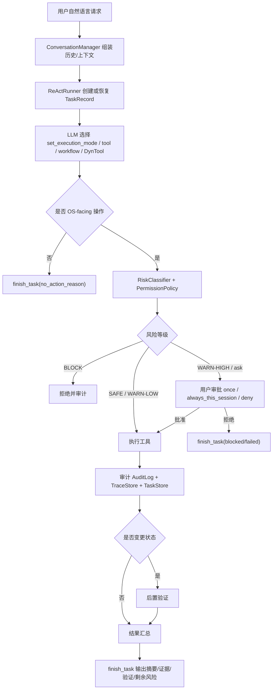

# 04. 关键场景决策逻辑、工具选择与执行路径

## 1. 总体执行路径



## 2. 工具选择原则

优先级：

1. 已有静态工具。
2. 内置 workflow。
3. 已注册可复用 DynTool。
4. inline `execute_dynamic_tool`。
5. `propose_dynamic_tool` 注册可复用工具族。

选择依据：

- 任务是否只读。
- 是否超过 3 个操作步骤。
- 是否命中安全内置流程。
- 是否涉及关键文件、服务、网络、用户、权限。
- 是否处于远程模式。
- 是否涉及回滚和后置验证。

## 3. 场景 A：只读系统巡检

用户输入：

```text
检查系统版本、负载、磁盘和正在监听的端口。
```

决策：

- mode：`plan` 或直接多工具。
- 工具：`get_system_info`、`get_disk_usage`、`get_resource_stats`、`get_port_status`。
- 风险：`SAFE`。
- 验证：工具返回系统信息即为证据。

预期结果：

- TUI 展示任务卡片。
- 工具区显示只读工具调用摘要。
- 结果区包含 hostname、kernel、load、disk、ports 证据。
- 审计中记录 SAFE 决策和 command trace。

## 4. 场景 B：重启 nginx

用户输入：

```text
重启 nginx，并确认它恢复正常。
```

决策：

- 先观察：`manage_service(name="nginx", action="status")` 或 `read_log`。
- 动作：`manage_service(name="nginx", action="restart")`。
- 风险：通常为 `WARN-HIGH`，进入审批流程。
- 验证：再次 `status`，必要时 `check_endpoint`。
- 完成门：必须满足 observe -> act -> verify -> finish。

失败处理：

- restart 失败时不能直接 completed。
- 失败后读取日志，降级为 failed/partial，或提示下一步。

## 5. 场景 C：安全修改配置

用户输入：

```text
把 nginx 配置里的 keepalive_timeout 改成 65，并验证配置。
```

决策：

- 命中 `safe_config_patch` workflow。
- 路径：dry-run preview -> `backup_path` -> `replace_in_file` -> `validate_config` -> 成功 finish。
- 锁：`file:<path>` 和可能的 `service:<name>` 通过 `LockStore` 跨进程 lease。
- 回滚：校验失败时执行 rollback。

可审计点：

- 预览 diff。
- 备份 id。
- 替换结果。
- 配置校验输出。
- rollback 结果。

## 6. 场景 D：远程 SSH 防锁门

用户输入：

```text
远程服务器上关闭 sshd。
```

决策：

- 远程模式下识别目标服务是 SSH。
- 命中 remote lockout 规则。
- 风险：`BLOCK`。
- 行为：拒绝执行并说明原因。

说明：

- `BLOCK` 不可由 `PermissionPolicy` 或用户审批降级。
- 审计记录拒绝原因和规则 id。

## 7. 场景 E：没有静态工具覆盖的诊断

用户输入：

```text
检查这个系统有没有安装某个发行版专用诊断命令，并输出版本。
```

决策：

- 先尝试静态信息工具。
- 静态工具无法覆盖时，使用 `execute_dynamic_tool` inline。
- 如果只是一次性命令，不注册 persistent DynTool。
- 模型错误声明 `changes_state=false` 时，系统仍按保守规则重新判定。

## 8. 场景 F：信息不足

用户输入：

```text
帮我修一下服务。
```

决策：

- 服务名、目标机、症状不明确。
- 不执行危险猜测。
- `finish_task(status="need_info")`，给出 1-3 个 next_steps/choices。

TUI 行为：

- 底部 choice bar 显示最多 3 个按钮。
- 点击按钮作为下一轮用户输入。

## 9. 场景 G：计划任务

用户输入：

```text
每天凌晨检查磁盘和关键服务状态。
```

决策：

- 使用 `manage_cron`。
- `job_target.kind` 只允许 `tool` 或 `workflow`。
- 安装内容通过 `--run-scheduled-job <job_id>` 回调。
- 运行时仍经过风险判断，`WARN-HIGH/BLOCK` 不进行非交互执行。

