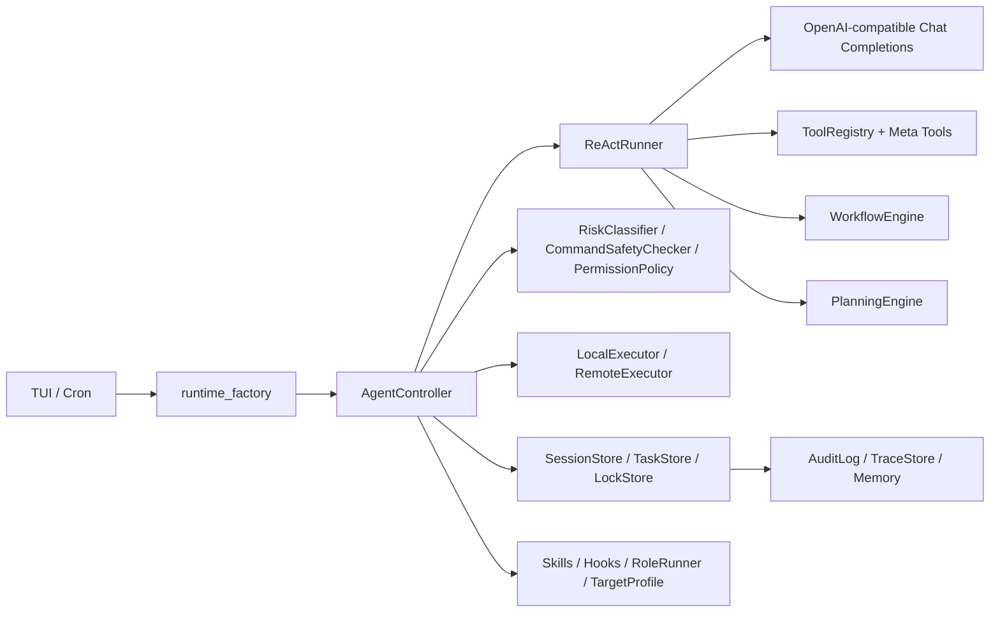

# 06. 设计说明文档

## 1. 总体架构



核心思想：

- LLM 负责理解意图、提出计划和选择工具。
- Python runtime 负责执行、状态、风险、锁、审计和验证。
- 用户界面只呈现任务卡片和审批，不复制业务逻辑。

## 2. 模块边界

| 模块 | 职责 |
| --- | --- |
| `sysdialogue/app/` | CLI、配置、runtime 创建、scheduled job。 |
| `sysdialogue/agent/controller.py` | 工具分发、安全门、审批、锁、审计、runtime glue。 |
| `sysdialogue/agent/react_runner.py` | ReAct 任务闭环、完成门、计划偏离拒绝、任务事件。 |
| `sysdialogue/agent/state_store.py` | Session / Task / Lock JSON + filelock 持久化。 |
| `sysdialogue/agent/planner.py` | plan freeze、风险预判、plan display；执行约束由 ReActRunner + TaskStore 承接。 |
| `sysdialogue/agent/workflow_engine.py` | YAML workflow 执行、模板渲染、rollback、lock_scope。 |
| `sysdialogue/tools/` | 静态工具、DynTool registry、元工具 schema。 |
| `sysdialogue/security/` | 风险分类、审批规则、远程锁门、命令安全。 |
| `sysdialogue/runtime/` | 本地/远程 executor、能力探测、目标机文件访问。 |
| `sysdialogue/ui/` | TUI task card、确认框、历史、审计/环境面板。 |

## 3. 实现进度与深度

已实现：

- OpenAI-compatible tool-calling 客户端。
- 37 个静态工具。
- 6 个元工具。
- 10 个 workflow。
- ReAct 任务级闭环。
- 动态迭代预算。
- TUI。
- 远程 SSH 执行。
- `standard` / `operator` / `break_glass` 三档安全配置。
- DynTool `argv` / `shell` 双执行模式。
- SessionStore / TaskStore / LockStore。
- PermissionPolicy、MemoryManager、TraceStore。
- Skills、Hooks、Role Handoff、TargetProfile。
- TUI 友好错误包装与技术详情折叠。

真实环境验收项：

- Linux 目标机上的 `safe_config_patch` 端到端。
- 真实服务 rollback 链路。
- 远程 SSH 变更 + 验证。
- cron/system cron 安装和回调。
- 多入口并发锁竞争。

## 4. 行为设计逻辑

### 4.1 为什么使用 ReAct 而不是单步 tool call

运维任务通常不是单次调用能完成：

- 先观察环境。
- 按结果调整计划。
- 失败后修复或回滚。
- 变更后验证。

因此系统将每轮用户请求建模为 task：

```text
task_started -> plan/observe -> act -> observe -> repair/continue -> verify -> finish_task
```

### 4.2 为什么不让模型直接输出 shell

直接输出 shell 有三个问题：

- 不可审计。
- 无法统一风险分级。
- 用户可能复制危险命令。

因此 prompt 强制：用户可见回复不得把底层命令作为操作建议，实际操作必须通过工具。

### 4.2.1 Function Call Only 安全策略

SysDialogue 的安全边界采用 **Function Call Only** 设计：模型不能直接执行系统命令，也不能通过自然语言要求用户复制命令到终端执行；所有会影响目标机、读取环境、修改配置、调用 SSH 或运行动态命令的动作，都必须以 OpenAI-compatible Chat Completions `tool_calls` / function call 的形式进入 Python runtime。

该策略的核心约束如下：

- 模型只负责选择工具、填写结构化参数和解释结果，不拥有 shell、文件系统或网络的直接执行权。
- 静态工具、workflow、DynTool、Skills、Hooks 和 Role Handoff 都统一走 `AgentController._dispatch_tool()` 或受控 meta tool 通路。
- 每一次 function call 都会先经过参数标准化、Schema/类型校验、`RiskClassifier`、`CommandSafetyChecker`、`PermissionPolicy` 和远程锁门规则。
- 命中 `WARN-HIGH` 的动作必须进入确认流程；命中 `BLOCK` 的动作不可被用户确认、session grant、技能或动态工具降级放行。
- DynTool 即使支持 one-shot command，也只接受结构化 `cmd_template` / `argv` / `shell_command` 参数，并继续经过命令安全检查、审批、审计、Trace 和 ReAct 完成门。
- 工具输出会回到 ReAct 作为 observation，模型必须基于 observation 调整计划、修复错误、验证变更，最后只能通过 `finish_task` 收口。
- UI 只展示计划摘要、工具摘要、审批结果、验证证据和错误包装；原始命令、stderr、traceback 等技术细节默认折叠，不作为用户手工执行指令。

因此，系统的可解释性和可审计性来自统一工具协议：任何真实操作都能追溯到一次 function call、一次风险判定、一次审批决策、一次执行结果和一次审计/Trace 记录。即使模型出现幻觉或输出不合规文本，ReActRunner 也会要求其改用工具或 `finish_task`，不会把自然语言当作可执行动作。

### 4.3 为什么保留 DynTool

静态工具无法覆盖所有 Linux 诊断命令。DynTool 的作用是保留开放性，但不能绕过安全。

设计取舍：

- `standard` 模式下静态工具和 workflow 优先。
- `break_glass` 模式下面向应急复杂任务，DynTool 可作为高能力执行通道。
- 优先 inline one-shot，避免同一任务创建几十个参数不同的动态工具。
- 可复用命令族才注册。
- 未证明只读时按变更处理。
- 硬拦截规则始终有效。

### 4.4 为什么使用 JSON + filelock

优点：

- 易于提交和检查。
- 无需数据库。
- 适合本地 agent 形态。
- 可被用户直接查看和备份。

限制：

- 不适合大规模多租户。
- 不提供复杂查询。
- 并发模型以 filelock 和 lease 为主，不是分布式锁。

## 5. 设计取舍

| 取舍 | 选择 | 原因 |
| --- | --- | --- |
| Agent 框架 | 自研轻量 runtime | 保持安全门、OpenAI-compatible、workflow 与持久化状态可控。 |
| 前端 | Textual | 避免引入复杂前端构建系统，便于演示和部署。 |
| 状态存储 | JSON + filelock | 轻量、可审计、易复现。 |
| 动态工具 | 分配置档控制能力边界 | `standard` 保持保守，`break_glass` 提升复杂任务执行能力，同时保留硬拦截和审计。 |
| Memory | Markdown + JSON | 第一版不引入向量库，降低复杂度。 |
| Role Handoff | 串行辅助决策 | 避免并发执行放大锁和审批复杂度。 |

